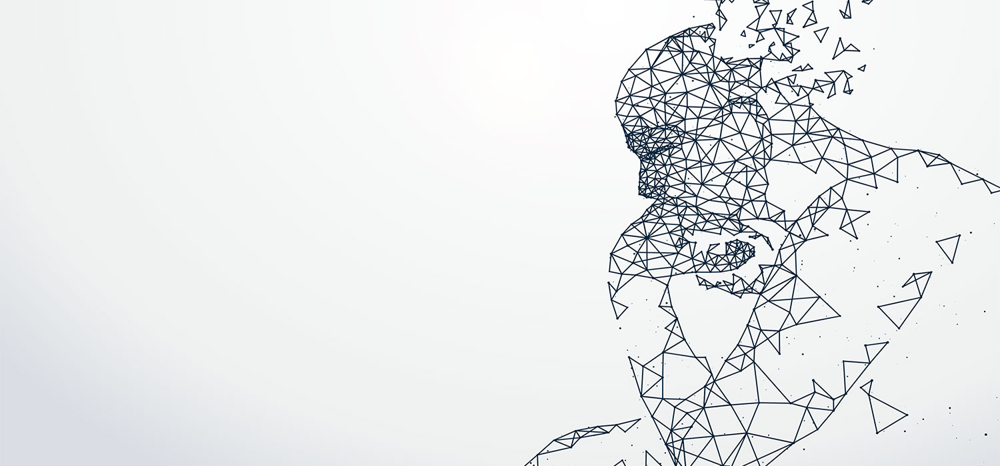

# Project Part 1: Scoping

Imagine you've been hired at a top tier quantitative think tank – HackyForge. They are a new group that tackles contemporary issues from an analytical angle. Sometimes there are clients, but oftentimes the team publishes with the intention of releasing their findings into the public domain.

Before setting sail on your project, however, the director must approve your plan of action. This document is incredibly important as it sets the *scope* of the project. No surprise, we call it the **scoping document**. Everything from how the data will be collected to  what kinds of conclusions you're hoping to draw should be described. Here, you'll be working in groups of at most 3, entirely up to you. 

## Deliverable: The Scoping Document

We'll use the following structure adapted from the [Center for Data Science and Public Policy](http://www.datasciencepublicpolicy.org/home/resources/data-science-project-scoping-guide/) at the University of Chicago. We expect 4 brief sections that outline your thoughts on the following:

- **Goals** – Define the goal(s) of the project
- **Data Collection** – What data do you have access to? What data do you need? What can you augment from other sources?
- **Analysis** – What analysis needs to be done? Does it involve description, detection, or prediction? How will the analysis be validated?
- **Ethical Considerations** – What are the privacy, transparency, discrimination/equity, and accountability issues around this project and how will you tackle them?

Submit a PDF document to Ishaan via Slack no later than **Sunday, Feb 21st** at 4pm. Reach out if you need an extension!

Any questions? Let your instructor know on Slack! We're more than happy to help out with anything, big or small. 

