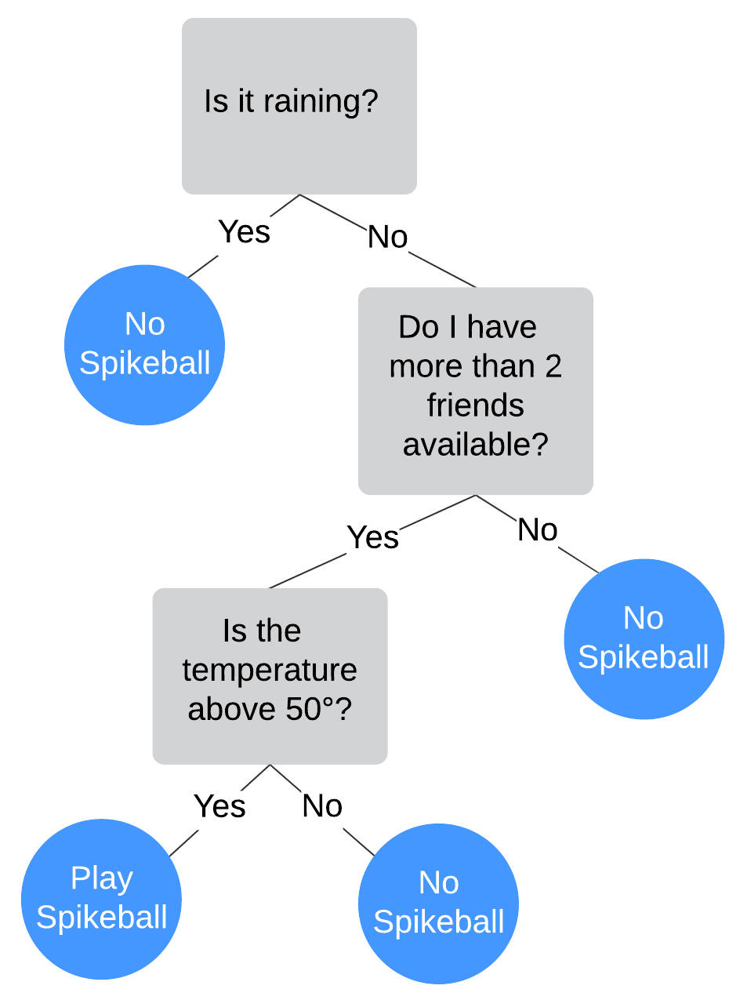

# Decision Trees

When making decision in everyday life, we tend to follow a process similar to that of decision trees. We'll see this with the following example.

## Deciding to play Spikeball on the lawn

You finished all of your work for the week, and would like to get outside and have some fun! You take a look outside and text your friends to see who is available. Then, you make a decision as to whether or not you are going to play Spikeball on the lawn.

Here are some examples of the decisions you made on previous days.

| Weather | Temperature | # of Friends Free | Played Spikeball |
| --------------- | --------------- | --------------- | --------------- |
| Sunny | 40° | 4 | No
| Sunny | 70° | 1 | No
| Sunny | 75° | 3 | Yes
| Partly Cloudy | 55° | 4 | Yes
| Partly Cloudy | 50° | 3 | No
| Cloudy | 40° | 4 | No
| Cloudy | 75° | 5 | Yes
| Rainy | 40° | 1 | No
| Rainy | 70° | 3 | No
| Rainy | 75° | 5 | No

&nbsp;

## Making a prediction

The conditions for today are described in the table below.

| Weather | Temperature | # of Friends Free |
| --------------- | --------------- | --------------- |
| Sunny | 40° | 3 |

&nbsp;

1. Based on your previous decisions, will you play Spikeball on the lawn today?
2. How did you come to that conclusion?

&nbsp;

&nbsp;

&nbsp;

&nbsp;

&nbsp;

## Making decisions

When deciding whether to play spikeball, you likely noticed that you have never played Spikeball on a rainy day, even when the temperature is high and there are enough friends to play. You have played before when 3, 4, or 5 friends were available, but never when only 1 friend was free. It also appears that the weather must be above 50° for you to play.

This decision making process is modeled in the image below.

## Make sure to not overfit

It is important to note that the data you will be working with in the real world will not be this perfect. For example, there could have been a beautiful day where many of your friends were available, but you decided not to play spikeball because you played soccer instead. Keep in mind that the goal of the decision tree is not to perfectly fit all of the data. With larger and more complex datasets, trees that are correct for every training instance will likely not perform as well when presented with new data. This is known as "overfitting," which we will cover later.